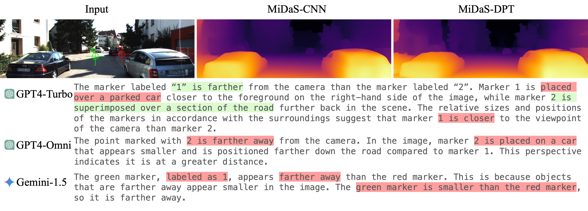

  <h1 align="center">Towards Foundation Models for 3D Vision: How Close Are We?</h1>
  

    <a href="https://zuoym15.github.io/"><strong>Yiming Zuo*</strong></a>
    ·
    <a href="https://kkayan.com/"><strong>Karhan Kayan*</strong></a>
    ·
    <a href=""><strong>Maggie Wang</strong></a>
    ·
    <a href=""><strong>Kevin Jeon</strong></a>
    ·
    <a href="https://www.cs.princeton.edu/~jiadeng/"><strong>Jia Deng</strong></a>    
    ·
    <a href="https://cocosci.princeton.edu/tom/index.php"><strong>Thomas L. Griffiths</strong></a>    
  

  

    (*equal contribution)
  

  <h4 align="center">
  Princeton University    
  </h4>

<h3 align="center"><a href="https://arxiv.org/abs/2410.10799">Paper</a> </a></h3>

  

## Download the Benchmark

Download the pre-generated image and question pairs in [this google drive link](https://drive.google.com/drive/folders/1zzz4GhJ_K3hXwCglpfxCeAmLPQYBK1kf?usp=sharing). We also provide instructions on how to generate the benchmark from the original datasets [here](benchmark_generation.md).

## Relative Depth Estimation

### Evaluate VLM accuracy

Go to the `LLM_evaluations/relative_depth` folder and run `python generate_gpt4v_response.py` (replace with your own OpenAI API key). This will save the GPT response in json format. We also provide the raw response we collected from GPT4v, GPT4o, and Gemini in [this google drive link](https://drive.google.com/drive/folders/1nLXSsMAMkoXC2b7FXeO-_GjuTWYp4hcQ?usp=sharing).

Then run `python evaluate_gpt4v_response.py`, which computes the accuracy. 

### Human response raw data

Go to the `Human_Study/relative_depth` folder and run `python evaluate_mturk.py`.

## Spatial VQA

### Evaluate VLM accuracy

Go to the `LLM_evaluations/clevr_vqa` folder and run `python generate_gpt_response.py` (replace with your own OpenAI API key). This will save the GPT response in json format. We also provide the raw response we collected from GPT4v, GPT4o, Gemini, and the specialized model [MDETR](https://github.com/ashkamath/mdetr) in [this google drive link](https://drive.google.com/drive/folders/1OSMQrgo5sGqyZnXSwDwTQ1hK4TPJ7qP4?usp=sharing).

Then run `python compute_acc.py`, which computes the accuracy. 

### Human response raw data

Go to the `Human_Study/clevr_vqa` folder and run `python evaluate_mturk.py`.

## Relative Camera Pose Estimation

### Evaluate VLM accuracy

Go to the `LLM_evaluations/relative_camera_pose` folder and run `python generate_gpt4v_response.py` (replace with your own OpenAI API key). This will save the GPT response in json format. We also provide the raw response we collected from GPT4v, GPT4o, and Gemini in [this google drive link](https://drive.google.com/drive/folders/1pRrlIE9X30p5VIUooRUHol6AJIhpxHhL?usp=sharing).

Then run `python evaluate_gpt4v_response.py`, which computes the accuracy.

### Human response raw data

Go to the `Human_Study/relative_camera_pose` folder and run `python evaluate_mturk.py`.